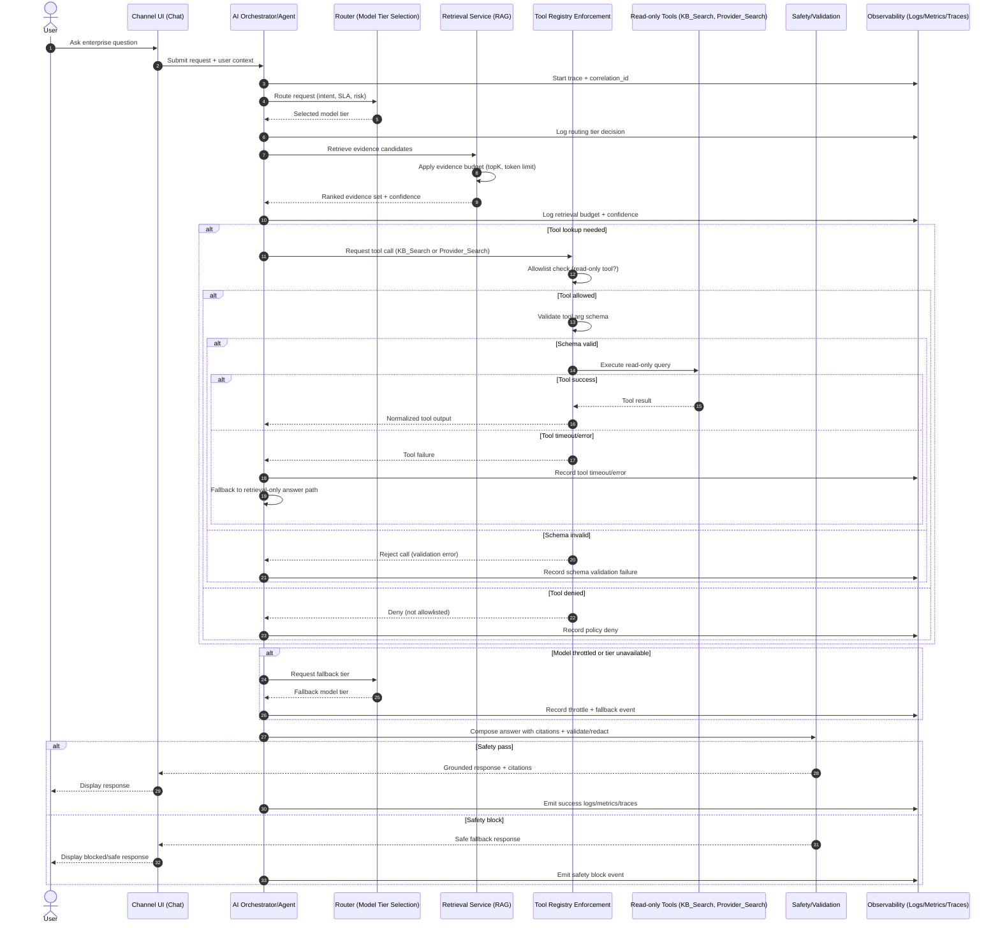

# Flow A Sequence: Enterprise RAG + Read-Only Tools

> **Status:** Architecture-focused | Vendor-neutral | Flow A + Flow B  
> **Flows:** Flow A (RAG + Read-Only Tools) | Flow B (Bounded Agent + HITL + Write Tools)  
> **Start Here:** [Reading Guide](../00-overview/reading-guide.md) | [Flow A Scope](../04-reference-flows/flow-a-rag-readonly/scope.md) | [Key Decisions](key-decisions.md)

## TL;DR
- Flow A routes requests, retrieves evidence, and optionally uses read-only tools.
- Tool usage is gated by allowlist and schema validation outside the model.
- Fallbacks handle model throttles and tool failures without mutating systems.
- Safety/validation determines final response release and observability records outcomes.

## Navigation
- Overview: [`00-overview/readme.md`](../00-overview/readme.md) | [`00-overview/reading-guide.md`](../00-overview/reading-guide.md)
- Architecture: [`01-architecture/key-decisions.md`](key-decisions.md) | [`01-architecture/c4-context.md`](c4-context.md) | [`01-architecture/sequence-a-rag-readonly.md`](sequence-a-rag-readonly.md) | [`01-architecture/sequence-b-agent-hitl.md`](sequence-b-agent-hitl.md)
- Governance: [`02-governance/model-routing-policy.md`](../02-governance/model-routing-policy.md) | [`02-governance/tool-registry-policy.md`](../02-governance/tool-registry-policy.md)
- Evaluation: [`03-evaluations/eval-plan.md`](../03-evaluations/eval-plan.md)

## Assumptions
- Only read-only tools are available in this flow; no mutating actions are permitted.
- Retrieval is required for enterprise knowledge answers; responses must be evidence-grounded.
- Request budgets are enforced (retrieval `topK`, context/token limits, and latency limits).

## End-to-End Sequence

> 🧪 **How we validate**
> This flow is verified through golden-set retrieval/groundedness tests, tool contract checks, and fallback-path reliability scenarios.

## Decision Points Called Out
- Routing tier decision: request intent/SLA/risk selects the primary model tier.
- Retrieval evidence budget: retrieval applies `topK` and token/context limits before generation.
- Tool allowlist check: tool registry enforces deny-by-default and read-only scope.
- Schema validation for tool arguments: invalid arguments are rejected before tool execution.
- Fallback behavior: model throttle/tier outage triggers routing fallback; tool failures trigger retrieval-only answer path.

## Failure Modes and Handling
- Model throttle/outage:
  - Use fallback ladder to a lower-cost or higher-availability tier.
  - Preserve trace continuity and emit throttle/fallback telemetry.
- Retrieval empty/low confidence:
  - Return a constrained answer (or abstain), include confidence language, and request clarification.
  - Avoid unsupported claims when evidence budget does not yield sufficient grounding.
- Tool timeout:
  - Treat tool call as optional enrichment; continue via retrieval-only path when possible.
  - Record timeout metrics for SLO tuning and tool reliability remediation.
- Safety block:
  - Replace blocked output with a safe response pattern.
  - Emit safety event with correlation metadata for review and policy tuning.
