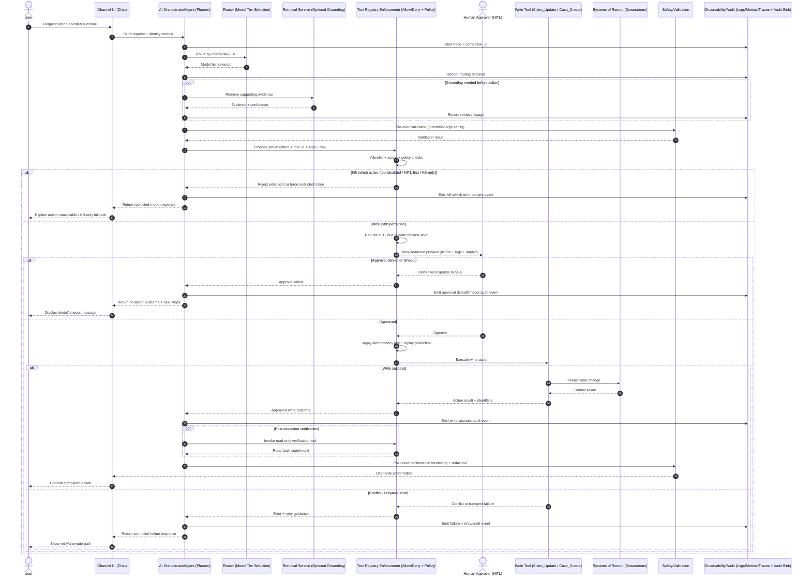

# Flow B Sequence: Bounded Agent + HITL + Write Tools

> **Status:** Architecture-focused | Vendor-neutral | Flow A + Flow B  
> **Flows:** Flow A (RAG + Read-Only Tools) | Flow B (Bounded Agent + HITL + Write Tools)  
> **Start Here:** [Reading Guide](../00-overview/reading-guide.md) | [Flow B Scope](../04-reference-flows/flow-b-agent-hitl/scope.md) | [Flow B Approval Policy](../04-reference-flows/flow-b-agent-hitl/approval-policy.md)

## TL;DR
- Flow B extends Flow A by allowing bounded write actions through approved tools.
- Every write path is gated by policy checks, HITL, and idempotency controls.
- Kill switches and restricted-mode fallbacks provide containment during incidents.
- Post-execution verification and audit telemetry close the loop on action safety.

## Navigation
- Overview: [`00-overview/readme.md`](../00-overview/readme.md) | [`00-overview/reading-guide.md`](../00-overview/reading-guide.md)
- Architecture: [`01-architecture/key-decisions.md`](key-decisions.md) | [`01-architecture/c4-context.md`](c4-context.md) | [`01-architecture/sequence-a-rag-readonly.md`](sequence-a-rag-readonly.md) | [`01-architecture/sequence-b-agent-hitl.md`](sequence-b-agent-hitl.md)
- Governance: [`02-governance/tool-registry-policy.md`](../02-governance/tool-registry-policy.md) | [`02-governance/incident-response-policy.md`](../02-governance/incident-response-policy.md)
- Evaluation: [`03-evaluations/eval-plan.md`](../03-evaluations/eval-plan.md)

## Context Note
Flow B is an extension of Flow A and is typically enabled after Flow A is stable in production with governance controls in place (tool registry enforcement, routing/fallback, observability, and incident runbooks).

## Assumptions
- Write tools are disabled by default and enabled only via explicit allowlist.
- HITL approval is required for any state-changing action in production.
- Idempotency keys are mandatory for all write actions.
- Full audit trail is required with end-to-end `correlation_id` propagation.

## End-to-End Sequence

> ⚠️ **Risk / Guardrail**
> Write actions remain controlled by deny-by-default tooling, HITL approvals, and replay-safe execution semantics.

## Decision Points Called Out
- Agent proposes action with explicit `intent`, `tool_id`, and arguments.
- Enforcement layer requires HITL because request is write-capable and risk-scored.
- Approver receives a redacted action preview and approves or denies.
- Idempotency key is applied before execution to prevent replay/duplicate writes.
- Post-execution verification performs read-back using a read-only capability when applicable.
- Kill switch path can force tool disablement, HITL-first hard mode, or KB-only operating mode.

## Safety Invariants
- Deny-by-default tools.
- Least-privilege scopes.
- No raw PHI in logs.
- Bounded tool call budgets.
- Approvals recorded.

## Failure Modes and Handling
- Approval timeout/denial:
  - No write is executed; return a no-action outcome and escalation path.
- Write tool conflict/retryable errors:
  - Use controlled retries under idempotency rules; surface deterministic retry guidance.
- Partial failure and rollback guidance:
  - Record action phase boundaries and apply compensating/rollback procedures per runbook.
- Incident containment mode:
  - Enable kill switches, restrict to KB-only/read-only behavior, and route to ops escalation.
